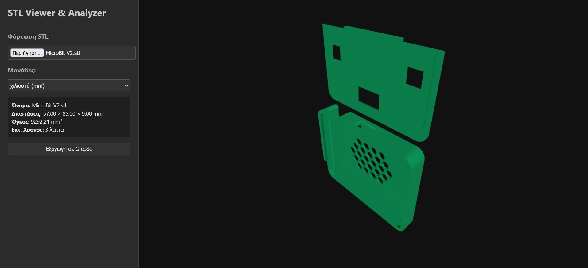

# STL Viewer & Analyzer

Το **STL Viewer & Analyzer** είναι ένα απλό εργαλείο προβολής και ανάλυσης αρχείων STL απευθείας στον browser. Υποστηρίζει εμφάνιση διαστάσεων, υπολογισμό όγκου, εκτίμηση χρόνου εκτύπωσης και εξαγωγή βασικού G-code.

## 🔧 Χαρακτηριστικά

- Προβολή 3D μοντέλων STL (binary ή ASCII)
- Υπολογισμός διαστάσεων σε mm ή ίντσες
- Υπολογισμός όγκου σε mm³
- Εκτίμηση χρόνου εκτύπωσης με βάση τον όγκο
- Εξαγωγή ενδεικτικού G-code
- Διαδραστικός χειρισμός μοντέλου με ποντίκι (zoom, περιστροφή, μετακίνηση)

## 🖥️ Τρόπος χρήσης

1. Κατέβασε τα αρχεία:
   - `index.html`
   - `three.module.js`
   - `OrbitControls.js`
   - `STLLoader.js`

2. Τοποθέτησέ τα στον ίδιο φάκελο.

3. Άνοιξε το `index.html` με έναν σύγχρονο browser.

💡 Αν αντιμετωπίσεις σφάλματα `CORS` ή `import`, άνοιξε τον φάκελο με τοπικό server:
```bash
python3 -m http.server
```

## ⏱ Υπολογισμός χρόνου εκτύπωσης

Ο χρόνος εκτύπωσης εκτιμάται ως εξής:

```bash
χρόνος (λεπτά) = όγκος (mm³) / ταχύτητα (mm³/s) / 60
```

Η προεπιλεγμένη ταχύτητα είναι 50 mm³/s.

## 📤 G-code

Η εξαγωγή G-code δημιουργεί ένα απλό, μη εκτυπώσιμο αρχείο με γενικές εντολές, μόνο για επίδειξη. Για πραγματικό slicing απαιτείται slicer όπως το Cura ή το PrusaSlicer.

## 🔍 Δοκιμές

Μπορείς να δοκιμάσεις το εργαλείο με αρχεία από:

    Thingiverse

    Printables

    STL αρχεία από τον υπολογιστή σου
	
## 🧱 Τεχνολογίες

    Three.js

    ES Modules (JavaScript)

    HTML5 / CSS
	
## 🔍 Screenshot



## ✅ Άδεια

Αυτό το έργο διατίθεται ελεύθερα για χρήση και τροποποίηση, χωρίς περιορισμούς.